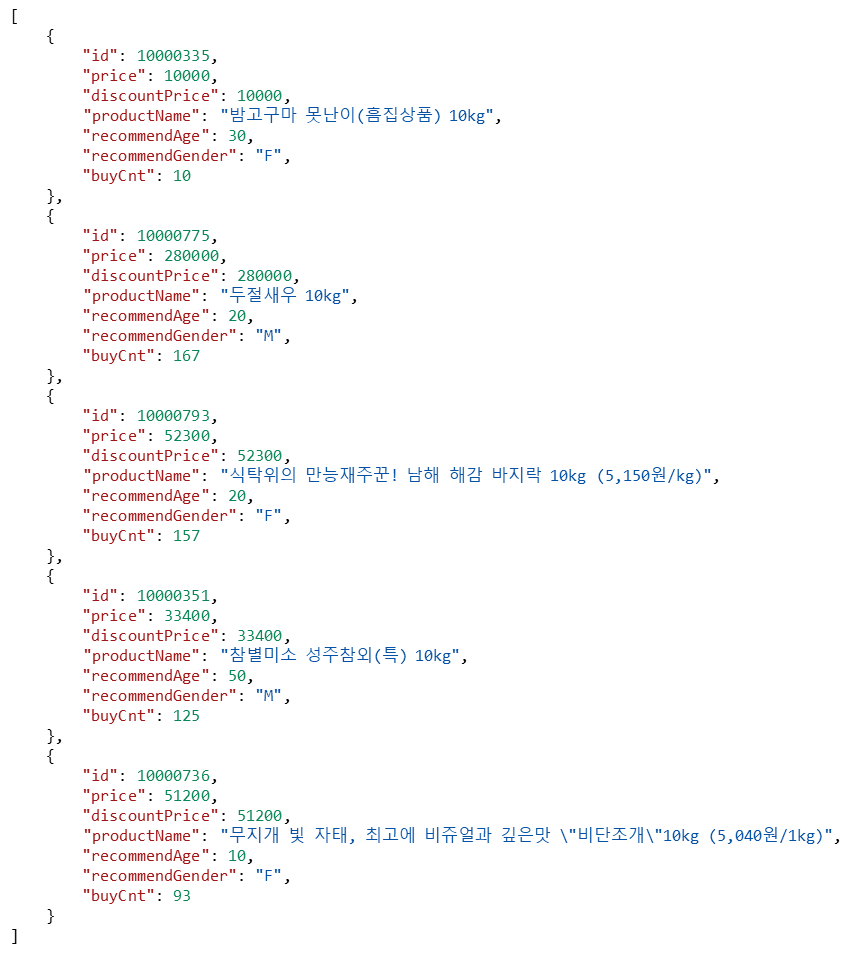
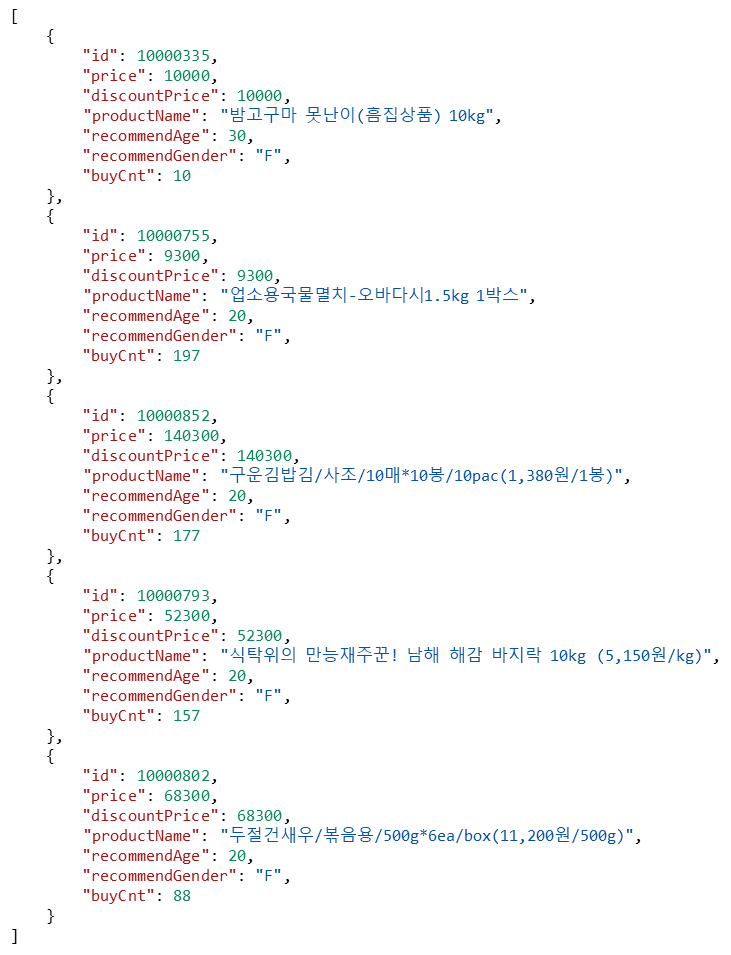
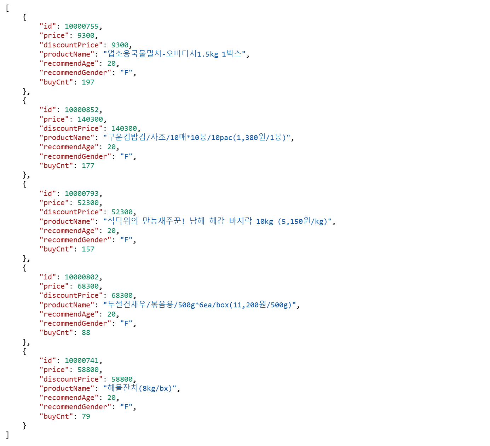
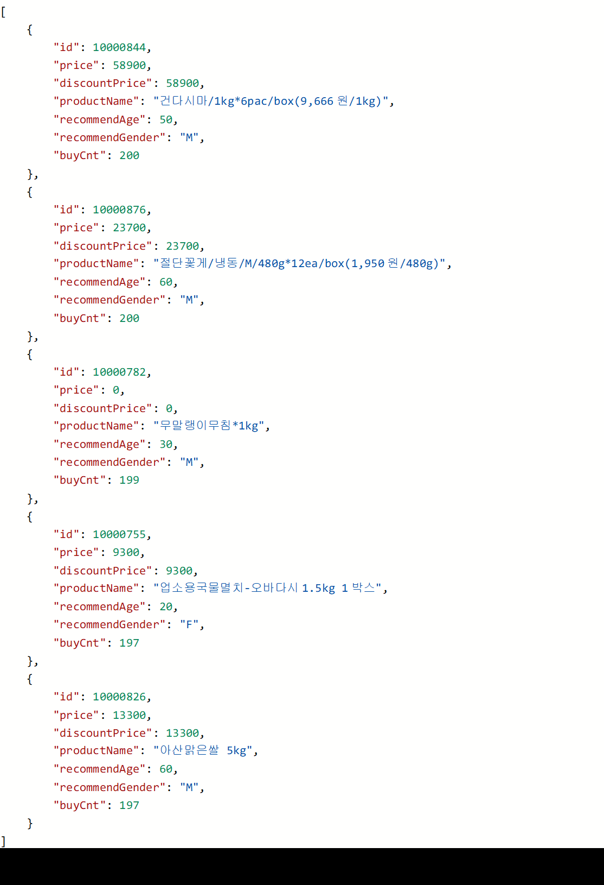

### 예시
1) 호출 url : localhost:9090/api/v1/product/recommended?keywords=못난이,밤고구마,10kg&userNo=%2B%2BSSHT7qUTgwqtgo97CSWg%3D%3D
    - 키워드가 가장 많이 일치는 상품을 위주로 보여줍니다.
      

2) localhost:9090/api/v1/product/recommended?keywords=못난이&userNo=%2B%2BSSHT7qUTgwqtgo97CSWg%3D%3D
    - 키워드가 일치하는 상품을 보여줍니다.
    - 나머지는 해당 사용자가 23세 여성으로 20대 여성에 대한 상품을 구매순으로 보여줍니다.     
      

3) localhost:9090/api/v1/product/recommended?keywords=카메라&userNo=%2B%2BSSHT7qUTgwqtgo97CSWg%3D%3D
    - 키워드에 해당하는 상품이 없으면 사용자 정보에 부합하는 상품을 구매순으로 보여줍니다.
      

4) localhost:9090/api/v1/product/recommended?keywords=카메라&userNo=%2B%2BcZ0P6j6MYoixUOecKZcg%3D%3D
    - 해당 사용자는 기본정보가 누락되어 있으므로 가장 구매순이 높은 상품을 순서대로 보여줍니다.
      